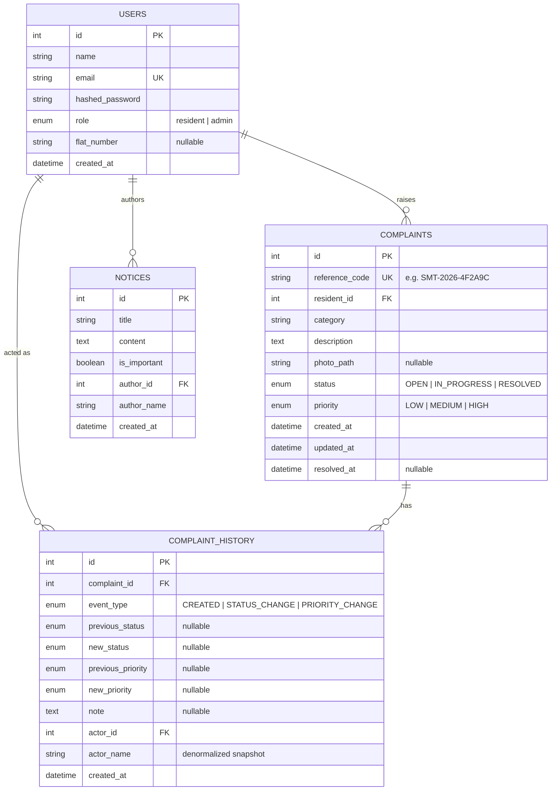

# SocietyHub — Database Schema

## Entity-Relationship Diagram

## Design Notes

- **Normalization**: structured facts (status, priority, category) are
  real columns with enum constraints, not packed into free text — this
  is what makes filtering/dashboard aggregation reliable and fast.
- **`complaint_history` is append-only**: no endpoint updates or deletes
  a row. It is the audit trail for the complaint lifecycle.
- **`reference_code`** is a unique, human-friendly identifier
  (`SMT-<year>-<6 hex chars>`) shown throughout the UI instead of the
  raw numeric primary key.
- **Cascading deletes**: `complaints.resident_id` and
  `complaint_history.complaint_id` use `ON DELETE CASCADE` so orphaned
  rows can't accumulate if a user or complaint is ever removed.
- **Indexes**: `users.email` (unique), `complaints.reference_code`
  (unique), and `complaints.status` / `.category` / `.priority` /
  `.created_at` are indexed since they're the primary filter/sort
  targets on the admin complaints view.
- **Overdue is not a column** — see `docs/system-design.md` §2 for why
  it's computed on read instead of stored.
- **Configuration** (`OVERDUE_THRESHOLD_DAYS`, email/storage settings)
  lives in environment variables (`app/config.py`), not a database
  table — it's deployment-time configuration, not application data.
